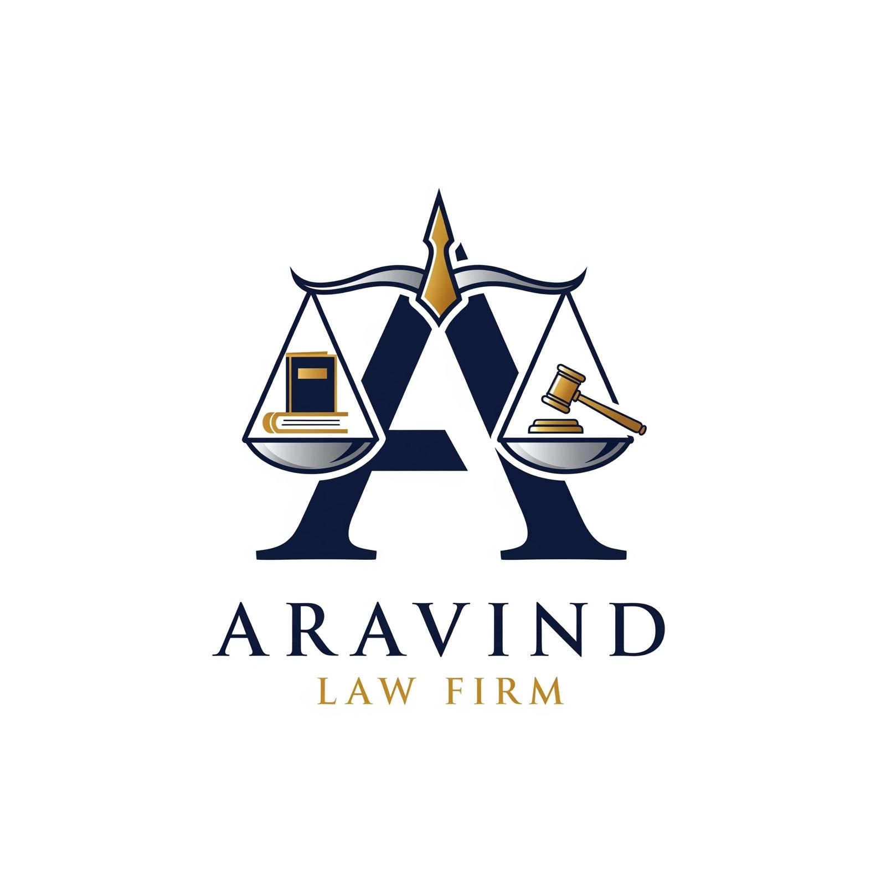

# ⚖️ Aravind Law Firm - Premium Legal Excellence



A modern, high-conversion website for **Aravind Law Firm**, one of Hyderabad's premier legal practices. Designed with a focus on authority, trust, and premium user experience, this platform showcases over 20 years of legal mastery.

## 🌟 Key Features

- **💎 Elite Design System**: Custom-built with a Navy & Gold palette, featuring glassmorphism, depth-based shadows, and fluid animations.
- **🏛️ Practice Areas**: Deep coverage of Civil, Securitization, Constitutional, Criminal, Family, and Motor Vehicle legal matters.
- **👥 Professional Team Profiles**: "Spicy" interactive profiles for V. Aravind and his associate advocates with hover-reveal details.
- **🖼️ Legacy Gallery**: A clean, high-resolution image gallery showcasing the firm's assets and professional journey.
- **🚀 SEO Optimized**: Advanced JSON-LD Schema implementation for local ranking and Knowledge Graph image integration.
- **📱 Fully Responsive**: Seamless experience across mobile, tablet, and desktop devices.
- **💬 Direct WhatsApp Integration**: One-click consultation access for immediate client engagement.

---

## 🛠️ Technology Stack

| Component | Technology |
| :--- | :--- |
| **Core** | HTML5 / CSS3 / JavaScript |
| **Styling** | Tailwind CSS (CDN) + Custom Vanilla CSS |
| **Icons** | Font Awesome 6.0 |
| **Fonts** | Google Fonts (Inter, Outfit) |
| **Animations** | Tailwind Animations + Scroll-Triggered JS |

---

## 📁 Project Structure

```bash
LawFirm/
├── assets/
│   ├── images/         # High-resolution legal & team photography
│   └── icons/          # Favicons and branding assets
├── index.html          # Main landing page with SEO & Schema.org data
├── styles.css          # Custom premium animations & design tokens
├── script.js           # Client-side logic & UI interactions
└── Readme.md           # Project Documentation
```

---

## 🚀 SEO Highlights

The project follows senior-developer SEO best practices:
- **Semantic HTML**: Proper use of `h1`-`h4` hierarchy.
- **Performance**: Optimized asset loading and zero-dependency logic.
- **Structured Data**: `LegalService` & `Person` Schema to ensure the firm appears professionally in Google Search Suggestions.

---

## 📞 Contact Information

- **📍 Office**: H.No 12-7-134/6/1, Moosapet, Kukatpally, Hyderabad
- **📞 Phone**: +91 9100499431
- **📧 Email**: Ventrapragadaaravind9100@gmail.com
- **📅 Hours**: Monday - Saturday: 9:00 AM - 7:00 PM

---

*Designed and Developed with Excellence for Aravind Law Firm.*
